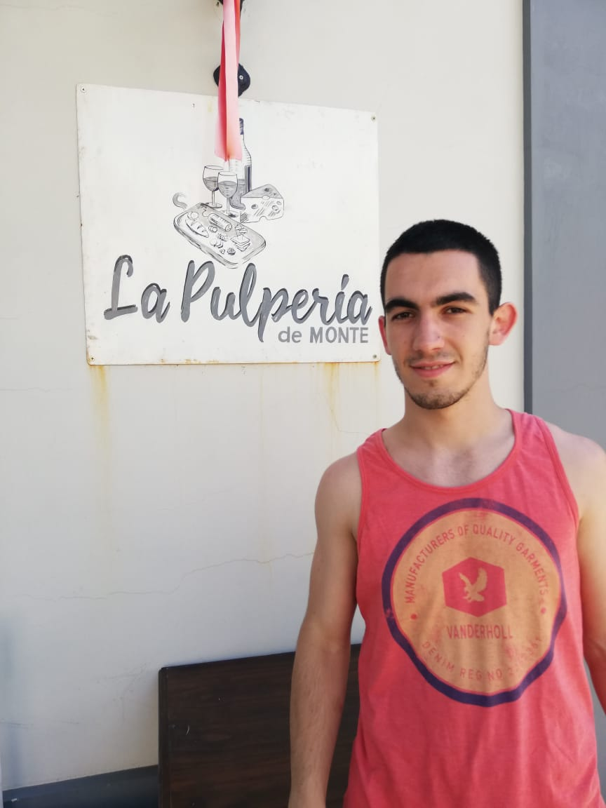

# Franco Nicolás Paesani
#### Numero legajo: 1681126
Hola a todos, me llamo Franco y tengo 20 años. Actualmente estoy trabajando 
de analista rpa asi que me estoy adentrando en el mundo de sistemas. 
Salí de un colegio técnico y entré a la facultad en el curso de verano del 2018,
por lo que me gustó la idea de estudiar ingeniería al resultarme entretenidas las matemáticas, programar y la electrónica.
`que decis??`

Dejando lo nerd de lado, me gusta hacer deporte, la música de los 80´s, 90´s y mirar series. Por el momento hago todo eso 
menos el deporte.
No tengo una pelicula favorita pero sí una saga, la cual es ***Harry Potter***. Nunca leí sus libros en los tiempos libres leo alguno de Sherlock. 

En cuanto a las series tengo dos favoritas: 

- Friends.
- Sherlock Holmes.

Además de todo eso, me gusta mucho viajar y conocer nuevos lugares. 
Gracias por ver mi presentación y nos veremos en las clases virtuales.
Saludos!!

Les dejo mi instagram y una foto: 

